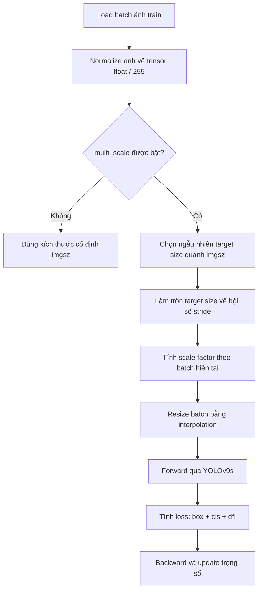
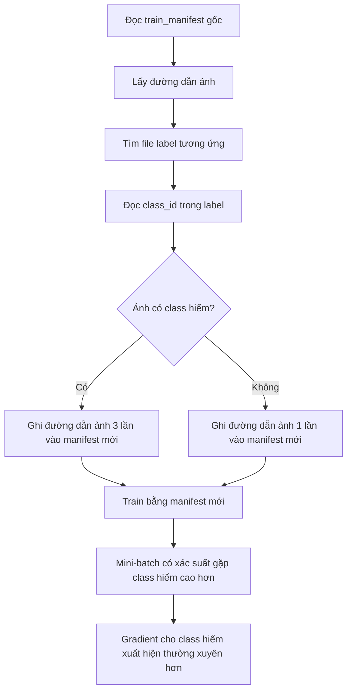
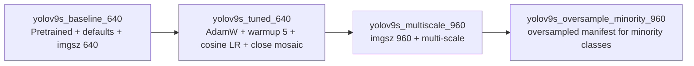

### Đoạn mở đầu

Nhóm em xây dựng benchmark theo chuỗi 4 biến thể YOLOv9s với mức độ can thiệp tăng dần. Điểm quan trọng của thiết kế thí nghiệm này là các biến thể không độc lập hoàn toàn, mà được tổ chức theo dạng **ablation tích lũy**: mỗi biến thể kế thừa toàn bộ cấu hình đã chứng minh hiệu quả ở bước trước, sau đó chỉ bổ sung thêm một nhóm thay đổi mới. Cách làm này giúp việc phân tích kết quả rõ ràng hơn: baseline cho biết năng lực ban đầu của YOLOv9s trên SH17, variant 1 đo tác động của tuning chiến lược huấn luyện, variant 2 đo thêm tác động của độ phân giải cao và multi-scale training, còn variant 3 đo thêm tác động của oversampling các lớp thiểu số.

Do đó, khi so sánh kết quả trên tập `val`, nhóm em không chỉ quan tâm mAP cuối cùng, mà còn quan tâm **mức đóng góp biên** của từng lớp cải tiến. Nói cách khác, câu hỏi của thí nghiệm không chỉ là “model cuối cùng tốt hơn bao nhiêu?”, mà còn là “mỗi quyết định kỹ thuật đã đóng góp thêm bao nhiêu vào kết quả cuối cùng?”.

Trong phần so sánh chính, nhóm em sử dụng `mAP50-95` trên tập `val` làm metric chính, đồng thời quan sát thêm `mAP50`, `precision`, `recall` và AP theo từng class để đánh giá ảnh hưởng của cải tiến lên các lớp nhỏ/hiếm.

---

### 1. Baseline `yolov9s_baseline_640`

Ở mốc đầu tiên, nhóm em dùng `yolov9s_baseline_640` làm chuẩn so sánh gốc. Đây không phải là một cấu hình ngẫu nhiên, mà là baseline được dựng theo tinh thần transfer learning cho family YOLOv9 trên SH17. Cụ thể, nhóm em dùng pretrained weight `yolov9s.pt`, train trong `200` epochs với image size cố định `640`, và giữ nguyên phần lớn training defaults của Ultralytics làm chiến lược huấn luyện nền.

Về ý nghĩa thực nghiệm, baseline này trả lời câu hỏi:

> Nếu chỉ lấy YOLOv9s pretrained và fine-tune trên SH17 với cấu hình gần mặc định, model đạt được mức hiệu năng nào?

Trong baseline, `imgsz=640` nghĩa là ảnh đầu vào được resize/letterbox về kích thước làm việc quanh 640 pixel. Đây là kích thước phổ biến vì cân bằng giữa chi phí tính toán và độ chi tiết của ảnh. Tuy nhiên, với dataset như SH17, nhiều đối tượng PPE có kích thước nhỏ hoặc nằm xa camera, nên `640` có thể làm mất một phần chi tiết không gian của các object nhỏ như `helmet`, `foot`, `safety-vest`, `ear-mufs`.

Cấu hình baseline dùng `optimizer=auto`.

Các tham số đáng chú ý trong baseline gồm:

* `epochs=200`: model đi qua toàn bộ tập train 200 lần.
* `imgsz=640`: độ phân giải train/val cơ sở.
* `warmup_epochs=3.0`: trong vài epoch đầu, learning rate không nhảy ngay lên giá trị mục tiêu mà tăng dần để ổn định training.
* `lrf=0.01`: learning rate cuối kỳ bằng `lr0 * 0.01`. Ví dụ nếu `lr0=0.01`, learning rate cuối xấp xỉ `0.0001`.
* `close_mosaic=10`: tắt mosaic ở 10 epoch cuối để model fine-tune trên ảnh gần phân phối thật hơn.
* `fliplr=0.5`: ảnh có xác suất 50% bị lật ngang, giúp tăng đa dạng dữ liệu.
* `val=True`: validation được chạy xuyên suốt để theo dõi checkpoint tốt nhất.

Điểm mạnh của baseline là đơn giản, dễ tái lập và phản ánh năng lực ban đầu của YOLOv9s trên SH17. Điểm hạn chế là baseline chưa tối ưu riêng cho đặc thù SH17: dữ liệu có class imbalance, nhiều object nhỏ, nhiều tình huống PPE bị che khuất hoặc xuất hiện ở vùng xa camera. Vì vậy, các biến thể sau được thiết kế để lần lượt xử lý các hạn chế này.

---

### 2. Variant 1 `yolov9s_tuned_640`

Biến thể đầu tiên là `yolov9s_tuned_640`. Biến thể này giữ nguyên model, pretrained weight, dataset và độ phân giải `640` của baseline, nhưng thay đổi chiến lược tối ưu hóa trong quá trình train. Vì vậy, đây là bước dùng để đo riêng ảnh hưởng của **training strategy tuning**.

Cụ thể, nhóm em thay `optimizer` sang `AdamW`, đặt `lr0=0.001`, `lrf=0.01`, tăng `warmup_epochs` lên `5`, bật `cos_lr=true`, giữ `close_mosaic=10`.

#### 2.1. `lr0` và `lrf` là gì?

`lr0` là initial learning rate, tức learning rate mục tiêu ở giai đoạn đầu sau warmup. Learning rate quyết định kích thước bước cập nhật trọng số sau mỗi lần backpropagation. Nếu learning rate quá lớn, loss có thể dao động mạnh hoặc không hội tụ; nếu quá nhỏ, model học chậm và dễ mắc kẹt ở nghiệm chưa tốt.

`lrf` là tỉ lệ learning rate cuối so với learning rate ban đầu. Công thức có thể hiểu đơn giản là:

```text
final_lr = lr0 * lrf
```

Với cấu hình của variant 1:

```text
lr0 = 0.001
lrf = 0.01
final_lr = 0.001 * 0.01 = 0.00001 = 1e-5
```

Điều này có nghĩa là model bắt đầu giai đoạn học chính với learning rate khoảng `1e-3`, sau đó scheduler giảm dần learning rate về khoảng `1e-5` ở cuối training. Cách này hợp lý cho fine-tuning vì đầu kỳ model cần học đủ mạnh để thích nghi với SH17, còn cuối kỳ cần bước cập nhật nhỏ hơn để tinh chỉnh bounding box và class prediction một cách ổn định.

#### 2.2. `warmup_epochs=5` là gì?

`warmup_epochs=5` nghĩa là trong khoảng 5 epoch đầu, learning rate được tăng dần từ rất nhỏ lên learning rate mục tiêu thay vì nhảy ngay lên `lr0`. Đây là một cơ chế ổn định giai đoạn đầu training.

Trong transfer learning, model bắt đầu từ pretrained weight đã học trên dataset lớn. Khi chuyển sang SH17, phân phối ảnh, class và annotation khác với dữ liệu gốc. Nếu learning rate tăng quá nhanh ngay từ đầu, gradient lớn có thể làm model “quên” nhanh các đặc trưng có ích từ pretrained weight hoặc làm loss dao động mạnh. Warmup giúp quá trình thích nghi mềm hơn:

```text
Epoch 0 -> LR rất nhỏ
Epoch 1 -> LR tăng nhẹ
Epoch 2 -> LR tăng tiếp
...
Epoch 5 -> LR đạt mức mục tiêu
```

Nói cách khác, warmup giống như giai đoạn “khởi động máy”: model được cho thời gian thích nghi với dataset mới trước khi bước vào giai đoạn tối ưu mạnh hơn.

#### 2.3. Vì sao dùng `AdamW`?

`AdamW` là optimizer thuộc nhóm adaptive optimizer. Khác với SGD, AdamW duy trì thống kê trung bình trượt của gradient và bình phương gradient cho từng tham số. Nhờ đó, mỗi tham số có thể được điều chỉnh với mức bước hiệu dụng khác nhau. Điều này thường hữu ích khi fine-tune model pretrained, vì các layer khác nhau có thể cần mức cập nhật khác nhau.

Điểm khác biệt quan trọng giữa Adam và AdamW nằm ở weight decay. Với AdamW, weight decay được tách khỏi phần cập nhật gradient thích nghi. Vì vậy, weight decay hoạt động giống một cơ chế regularization rõ ràng hơn, giúp hạn chế trọng số tăng quá lớn và giảm nguy cơ overfitting.

* `AdamW` giúp bước cập nhật thích nghi theo từng tham số, phù hợp với fine-tuning.
* `lr0=0.001` là mức learning rate thường hợp lý hơn cho Adam/AdamW so với `0.01`, vì AdamW đã có cơ chế adaptive update nên không cần learning rate lớn như SGD.
* Weight decay trong AdamW giúp giảm nguy cơ model học quá khớp vào các pattern lặp lại trong tập train, nhất là khi dataset không quá lớn hoặc có mất cân bằng class.

#### 2.4. `cos_lr=true` là gì?

`cos_lr=true` bật cosine learning rate scheduler. Thay vì giảm learning rate theo đường thẳng, cosine scheduler giảm learning rate theo đường cong cosine: đầu quá trình giảm chậm hơn, giữa quá trình giảm đều hơn, và cuối quá trình tiến dần về learning rate rất nhỏ.

Có thể hình dung như sau:

```text
LR cao hơn ở đầu kỳ  ->  model học nhanh các đặc trưng phù hợp SH17
LR giảm mượt ở giữa ->  model ổn định dần
LR rất nhỏ cuối kỳ  ->  model tinh chỉnh chi tiết, tránh phá vỡ nghiệm tốt
```

Với `lr0=0.001` và `lrf=0.01`, cosine scheduler đưa learning rate từ khoảng `1e-3` về khoảng `1e-5`. Điểm quan trọng là quá trình giảm này mượt hơn so với linear decay, giúp training ổn định hơn ở cuối kỳ.

#### 2.5. `close_mosaic=10` là gì?

Mosaic augmentation là kỹ thuật ghép nhiều ảnh, thường là 4 ảnh, vào một ảnh training mới. Kỹ thuật này giúp model thấy nhiều object hơn trong một batch, đa dạng hóa bối cảnh và tăng khả năng tổng quát. Tuy nhiên, ảnh mosaic không hoàn toàn giống ảnh thật trong validation hoặc inference vì nó tạo ra bố cục nhân tạo.

`close_mosaic=10` nghĩa là trong 10 epoch cuối, mosaic bị tắt. Lý do là giai đoạn cuối training nên ưu tiên cho model nhìn ảnh gần với phân phối thật hơn. Khi mosaic bị tắt, model fine-tune lại trên ảnh tự nhiên hơn, giúp bounding box, scale object và ngữ cảnh ảnh gần với tập `val` hơn.

Có thể hiểu training được chia thành hai giai đoạn:

```text
Epoch đầu và giữa:
  dùng mosaic để tăng đa dạng dữ liệu, chống overfitting

10 epoch cuối:
  tắt mosaic để model tinh chỉnh trên ảnh thật hơn
```

#### 2.6. Tóm tắt ý nghĩa variant 1

Tóm lại, `yolov9s_tuned_640` có thể được hiểu là:

```text
baseline_640 + optimizer/scheduler tuning
```

Cụ thể, variant này vẫn giữ nguyên dữ liệu, model và độ phân giải, nhưng tổ chức lại quá trình học:

* warmup dài hơn để ổn định giai đoạn đầu;
* AdamW để fine-tune thích nghi hơn;
* learning rate nhỏ hơn và phù hợp hơn với AdamW;
* cosine scheduler để giảm learning rate mượt hơn;
* tắt mosaic cuối kỳ để fine-tune trên phân phối ảnh gần validation;
* patience thấp hơn để hạn chế training kéo dài khi val không cải thiện.

Sau khi thêm lớp cải tiến này, kết quả trên tập `val` tăng từ `...` lên `...`, tương đương cải thiện khoảng `...%` so với baseline.

---

### 3. Variant 2 `yolov9s_multiscale_960`

Biến thể thứ hai là `yolov9s_multiscale_960`. Biến thể này kế thừa toàn bộ `yolov9s_tuned_640`, sau đó bổ sung hai thay đổi liên quan đến scale: tăng `imgsz` từ `640` lên `960` và bật `multi_scale`.

Do đó, variant 2 không nên được hiểu là một cấu hình mới tách rời, mà là:

```text
tuned_640 + high-resolution training + multi-scale training
```

#### 3.1. Vì sao tăng `imgsz` từ 640 lên 960?

SH17 có nhiều đối tượng PPE nhỏ hoặc chi tiết nằm xa camera. Với ảnh input `640`, một object nhỏ có thể chỉ chiếm rất ít pixel sau resize. Khi tăng `imgsz` lên `960`, số pixel theo mỗi chiều tăng 1.5 lần, còn tổng số pixel tăng:

```text
960² / 640² = 2.25 lần
```

Điều này giúp model giữ được nhiều chi tiết không gian hơn. Với các class như `helmet`, `foot`, `safety-vest`, `ear-mufs`, `face-guard`, sự khác biệt vài pixel có thể ảnh hưởng lớn đến khả năng phân biệt class và định vị bounding box.

#### 3.2. `multi_scale` là gì?

`multi_scale` là chiến lược training trong đó kích thước ảnh input không cố định ở một giá trị duy nhất cho mọi batch. Thay vào đó, mỗi batch có thể được resize sang một kích thước khác nhau quanh kích thước gốc `imgsz`.

Ví dụ, nếu dùng:

```text
imgsz = 960
multi_scale = 0.25
```

thì kích thước train có thể dao động xấp xỉ trong khoảng:

```text
min_size = 960 * (1 - 0.25) = 720
max_size = 960 * (1 + 0.25) = 1200
```

Vì YOLO cần kích thước ảnh phù hợp với stride của model, kích thước thực tế sẽ được làm tròn về bội số của stride, thường là 32. Do đó, thay vì đúng 720 hay 1200 tuyệt đối, kích thước batch có thể là các giá trị như:

```text
736, 768, 800, ..., 1152, 1184, 1216
```

> Nhóm em bật multi-scale training. Với cơ chế này, ở mỗi batch, kích thước ảnh train được thay đổi ngẫu nhiên quanh `imgsz=960` và được làm tròn theo stride của model. Nhờ vậy, model không chỉ học object ở một scale cố định, mà được tiếp xúc với cùng loại object ở nhiều scale hiệu dụng khác nhau.

#### 3.3. Multi-scale hoạt động cụ thể như thế nào?

Có thể mô tả pipeline multi-scale như sau:



Ví dụ với `imgsz=960`, `multi_scale=0.25`, stride `32`:

```text
Batch 1: target size ≈ 768
Batch 2: target size ≈ 960
Batch 3: target size ≈ 1120
Batch 4: target size ≈ 896
Batch 5: target size ≈ 1184
```

Như vậy, cùng một object `helmet` có thể xuất hiện với nhiều kích thước hiệu dụng khác nhau trong quá trình train. Điều này buộc model học đặc trưng bền vững hơn theo scale, thay vì chỉ tối ưu cho đúng một độ phân giải cố định.

#### 3.4. Vì sao multi-scale phù hợp với SH17?

Trong SH17, cùng một loại PPE có thể xuất hiện rất khác nhau về kích thước:

* công nhân gần camera: helmet/safety vest lớn, rõ;
* công nhân xa camera: helmet/safety vest nhỏ, dễ mất chi tiết;
* góc nhìn nghiêng hoặc bị che khuất: object bị biến dạng hoặc chỉ lộ một phần;
* nhiều người trong cùng khung hình: object có scale không đồng nhất.

Nếu chỉ train ở `640` hoặc chỉ train cố định ở `960`, model có thể học tốt ở một scale nhất định nhưng kém bền khi object thay đổi kích thước. Multi-scale training giải quyết điểm này bằng cách biến scale thành một dạng augmentation ở cấp input size.

#### 3.5. Phân biệt `scale` augmentation và `multi_scale`

Cần tránh nhầm giữa `scale` augmentation và `multi_scale`.

`scale` augmentation thường là phép biến đổi hình học trong pipeline augmentation, làm object trong ảnh bị phóng to/thu nhỏ tương đối trong quá trình tạo ảnh train.

`multi_scale` là thay đổi kích thước input của cả batch trước khi đưa vào model. Nó không chỉ thay đổi object trong ảnh, mà còn thay đổi độ phân giải tensor mà model xử lý.

Có thể viết ngắn gọn:

```text
scale augmentation:
  thay đổi hình học bên trong ảnh

multi_scale:
  thay đổi kích thước input của batch/model trong quá trình train
```

Hai cơ chế này có thể bổ sung cho nhau, nhưng không phải là một.

#### 3.6. Tóm tắt ý nghĩa variant 2

Tóm lại, `yolov9s_multiscale_960` là:

```text
tuned_640 + imgsz=960 + multi_scale
```

Variant này nhắm vào hạn chế chính của baseline và variant 1: nhiều PPE object trong SH17 có kích thước nhỏ, nên model cần nhiều chi tiết ảnh hơn và cần học bền vững hơn trước thay đổi scale. Tăng `imgsz` giúp giữ chi tiết; multi-scale giúp model không bị phụ thuộc vào một kích thước input cố định.

Sau khi thêm lớp cải tiến này, kết quả trên tập `val` tăng từ `...` lên `...`, tức cải thiện khoảng `...%` so với biến thể ngay trước đó, và khoảng `...%` so với baseline.

---

### 4. Variant 3 `yolov9s_oversample_minority_960`

Biến thể cuối cùng là `yolov9s_oversample_minority_960`. Đây là biến thể tổng hợp cuối chuỗi, kế thừa toàn bộ `yolov9s_multiscale_960`, nghĩa là giữ lại baseline, giữ lại tuning training strategy, giữ lại `imgsz=960`, giữ lại multi-scale training, rồi bổ sung một cải tiến cuối cùng: oversampling các ảnh chứa class thiểu số.

Do đó, variant này nên được hiểu là:

```text
multiscale_960 + oversampling minority classes
```

#### 4.1. Vì sao cần oversampling?

Trong bài toán object detection trên SH17, class imbalance có thể xuất hiện ở hai mức:

1. **Image-level imbalance**: số ảnh chứa class hiếm ít hơn nhiều so với class phổ biến.
2. **Instance-level imbalance**: số bounding box của class hiếm ít hơn nhiều so với class phổ biến.

Khi dữ liệu bị lệch như vậy, mini-batch trong quá trình train thường chứa nhiều object thuộc class phổ biến hơn. Hệ quả là gradient cập nhật cho các class phổ biến xuất hiện thường xuyên hơn, còn class hiếm ít được model học đủ. Điều này có thể làm AP của class hiếm thấp, dù mAP tổng thể vẫn có vẻ ổn.

Với SH17, các class được ưu tiên oversampling là:

```text
2  -> ear-mufs
4  -> face-guard
6  -> foot
10 -> helmet
13 -> medical-suit
16 -> safety-vest
```

Trong đó, một số class có thể hiếm do ít xuất hiện thật trong dataset, còn một số class như `helmet` hoặc `safety-vest` tuy quan trọng nhưng có thể khó học do object nhỏ, bị che khuất hoặc có variation lớn.

#### 4.2. Cơ chế `use_oversampled_train_manifest=true`

Cải tiến mới nằm ở việc tạo manifest train mới. Pipeline đọc từng ảnh trong `train_manifest`, mở label tương ứng, kiểm tra các class xuất hiện trong file label. Nếu ảnh có chứa ít nhất một class thuộc nhóm ưu tiên, đường dẫn ảnh đó được ghi lặp lại 3 lần trong manifest mới. Nếu không chứa class ưu tiên, ảnh chỉ được giữ 1 lần.

Cơ chế có thể mô tả bằng Mermaid như sau:



Điểm quan trọng là oversampling không tạo ảnh mới, không chỉnh sửa annotation và không thay đổi loss function. Nó chỉ thay đổi xác suất lấy mẫu ảnh trong quá trình training.

#### 4.3. Oversampling ảnh khác gì oversampling object?

Cách nhóm em đang dùng là **image-level oversampling**. Nghĩa là nếu một ảnh chứa class hiếm, toàn bộ ảnh được lặp lại. Điều này làm tăng tần suất xuất hiện của các object hiếm, nhưng cũng đồng thời lặp lại các object phổ biến nằm trong cùng ảnh.

Ví dụ, nếu một ảnh có:

```text
1 face-guard
3 person
2 helmet
```

và `face-guard` là class hiếm, ảnh này được lặp lại 3 lần. Khi đó, model không chỉ thấy `face-guard` nhiều hơn, mà cũng thấy lại `person` và `helmet` trong ảnh đó nhiều hơn. Vì vậy, oversampling ảnh là cách đơn giản và dễ triển khai, nhưng không hoàn toàn chỉ tăng riêng class hiếm.

#### 4.4. Rủi ro của oversampling

Oversampling có hai rủi ro chính.

Thứ nhất, vì ảnh được lặp lại, model có thể overfit vào những ảnh chứa class hiếm, đặc biệt nếu số ảnh hiếm ban đầu rất ít. Dấu hiệu là train loss tiếp tục giảm nhưng val mAP hoặc AP của class hiếm không tăng tương ứng.

Thứ hai, nếu lặp quá nhiều lần, phân phối train có thể lệch khỏi phân phối val/test. Khi đó model học quá nhấn mạnh vào một nhóm ảnh nhất định. Vì vậy, hệ số lặp `3` lần là một lựa chọn vừa phải hơn so với lặp quá lớn như 5 hoặc 10 lần.

Nên bổ sung (làm một slide cho phần này, hiện tại chưa có số liệu cụ thể, nên để dấu ...):
* số ảnh gốc trong train manifest;
* số ảnh sau oversampling;
* số ảnh chứa từng class hiếm trước và sau oversampling;
* AP theo từng class trước và sau oversampling;
* confusion matrix để xem class hiếm còn bị nhầm với class nào.

#### 4.5. Tóm tắt ý nghĩa variant 3

Tóm lại, `yolov9s_oversample_minority_960` là bước mở rộng trực tiếp của `multiscale_960`. Nếu variant 2 giải quyết vấn đề object nhỏ và scale variation, thì variant 3 giải quyết thêm vấn đề mất cân bằng dữ liệu.

Có thể tóm tắt chuỗi cải tiến như sau:



Sau khi thêm lớp cải tiến cuối cùng này, kết quả trên tập `val` tăng từ `...` lên `...`, tương đương cải thiện khoảng `...%` so với `multiscale_960`, và khoảng `...%` so với baseline.

### 5. Bảng kết quả 

| Variant                           | Kế thừa từ     | Thay đổi mới               | imgsz train | multi-scale | Oversampling | mAP50 | mAP50-95 | Δ so với trước | Δ so với baseline |
| --------------------------------- | -------------- | -------------------------- | ----------: | ----------- | ------------ | ----: | -------: | -------------: | ----------------: |
| `yolov9s_baseline_640`            | -              | Baseline YOLOv9s           |         640 | No          | No           |   ... |      ... |              - |                 - |
| `yolov9s_tuned_640`               | baseline       | AdamW + LR schedule tuning |         640 | No          | No           |   ... |      ... |            ... |               ... |
| `yolov9s_multiscale_960`          | tuned_640      | `imgsz=960` + multi-scale  |         960 | Yes         | No           |   ... |      ... |            ... |               ... |
| `yolov9s_oversample_minority_960` | multiscale_960 | Oversampled manifest       |         960 | Yes         | Yes          |   ... |      ... |            ... |               ... |
