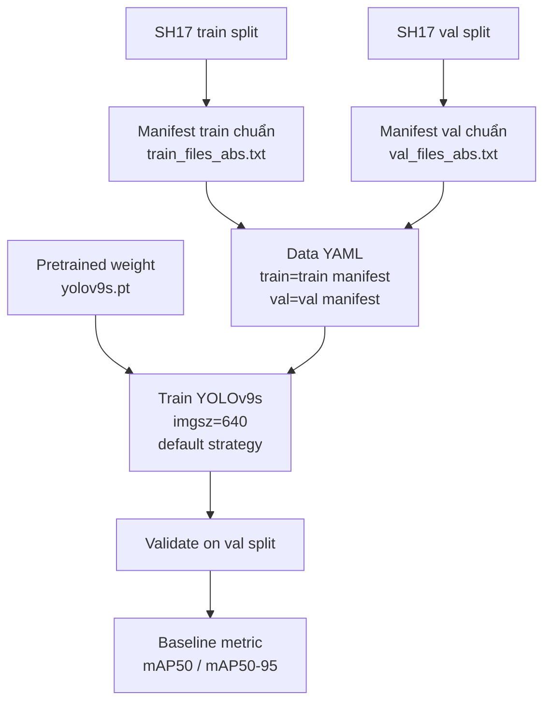
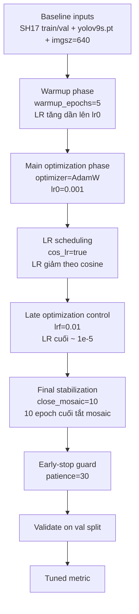
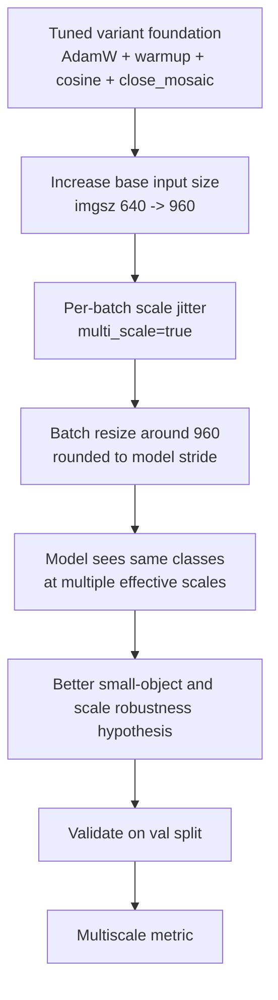
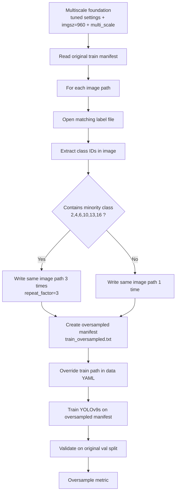

# YOLOv9s Variants

Nguồn cấu hình hiện tại: [sh17_yolov9s_experiments.yaml](D:\DS-AI\SH17\configs\sh17_yolov9s_experiments.yaml)

## Tổng quan

Notebook `yolov9s` hiện có 4 biến thể:

1. `yolov9s_baseline_640`
2. `yolov9s_tuned_640`
3. `yolov9s_multiscale_960`
4. `yolov9s_oversample_minority_960`

Chuỗi biến thể này giữ cùng logic với `yolov9c`, nhưng dùng base model nhỏ hơn để train nhanh hơn và dễ so sánh giữa các hướng cải tiến.

## Tóm tắt nhanh

| Variant | Vai trò | Khác baseline | Khác biến thể trước |
| --- | --- | --- | --- |
| `yolov9s_baseline_640` | Mốc so sánh gốc | Không áp dụng | Không áp dụng |
| `yolov9s_tuned_640` | Tối ưu training strategy ở cùng độ phân giải | Đổi optimizer/scheduler/warmup/patience | Thêm tuning training, giữ `imgsz=640` |
| `yolov9s_multiscale_960` | Ưu tiên small objects | Tăng `imgsz`, bật `multi_scale`, giữ tuning chính | So với `tuned_640`: tăng độ phân giải, bật multi-scale, bỏ override `patience=30` |
| `yolov9s_oversample_minority_960` | Ưu tiên minority classes | Giữ cấu hình high-resolution và thêm oversampling | So với `multiscale_960`: chỉ thêm oversampling manifest |

## 1. `yolov9s_baseline_640`

### Mục đích

Đây là baseline của nhánh `yolov9s`, dùng để so sánh với toàn bộ các biến thể cải tiến phía sau. Về mặt ý nghĩa, baseline này đóng vai trò là cấu hình "paper-aligned" cho YOLOv9s: nó cố bám theo những gì paper SH17 nêu rõ đối với nhóm YOLOv9, rồi giữ nguyên các thành phần đó để làm mốc trước khi thêm bất kỳ cải tiến nào.

### Cấu hình chính

- `weights: yolov9s.pt`
- `imgsz: 640`
- `epochs: 200`
- `batch: -1`
- `workers: 8`
- `patience: 40`
- `save_period: 10`

### Baseline này mô phỏng paper ở những điểm nào

Theo [SH17_paper_summary.md](D:\DS-AI\SH17\SH17_paper_summary.md:137), paper mô tả các điểm train chung của họ như sau:

- YOLOv9 dùng pretrained weights từ MS-COCO rồi transfer learning trên SH17
- fixed input size `640`
- train `200` epochs
- augmentation chính là mosaic 4 ảnh và horizontal flip
- cùng một pipeline train chung ở mức cao cho toàn bộ family YOLOv9

`yolov9s_baseline_640` được dựng để bám vào đúng những điểm đó:

- dùng `yolov9s.pt` pretrained làm điểm khởi đầu
- train ở `imgsz=640`
- train `200` epochs
- dùng training defaults của Ultralytics làm chiến lược huấn luyện nền
- giữ data pipeline chuẩn `train manifest -> data yaml -> train -> validate on val`

Nói ngắn gọn, baseline này trả lời câu hỏi: nếu lấy YOLOv9s và train theo tinh thần chung mà paper đã dùng cho family YOLOv9, với một training recipe nền đầy đủ và tái lập được trên SH17, kết quả sẽ ở đâu.

### Baseline gồm những gì, theo đúng pipeline hiện tại

Để người đọc hình dung cụ thể, `yolov9s_baseline_640` hiện gồm đầy đủ các thành phần sau:

- mô hình khởi tạo là `yolov9s.pt`
- đầu vào train được chuẩn hóa về `imgsz=640`
- số epoch huấn luyện là `200`
- optimizer trong config là `optimizer=auto`
- theo default hiện tại của Ultralytics, baseline đi kèm:
  - `lr0=0.01`
  - `lrf=0.01`
  - `warmup_epochs=3.0`
  - `cos_lr=False`
  - `close_mosaic=10`
  - `momentum=0.937`
  - `weight_decay=0.0005`
- augmentation nền của baseline đi theo Ultralytics defaults:
  - `mosaic=1.0`
  - `fliplr=0.5`
  - `flipud=0.0`
  - cùng các augmentation màu và hình học mặc định khác của YOLO detect train pipeline
- dữ liệu train được đọc từ `train_files.txt`, resolve sang đường dẫn tuyệt đối và ghi thành `train_files_abs.txt`
- dữ liệu validation được đọc từ `val_files.txt`, resolve sang đường dẫn tuyệt đối và ghi thành `val_files_abs.txt`
- file `sh17.yaml` được tạo với:
  - `train = train_files_abs.txt`
  - `val = val_files_abs.txt`
  - `test = val_files_abs.txt`
  - `names = 17 class của SH17`
- model được train trực tiếp bằng manifest chuẩn này
- validation được chạy trên tập `val` trong suốt quá trình train và ở bước evaluate cuối
- checkpoint được lưu định kỳ theo `save_period=10`, đồng thời có `best.pt` và `last.pt`
- early stopping dùng `patience=40`
- worker dataloader là `8`
- batch hiện lấy theo cấu hình mặc định của notebook/config local

### Training strategy của baseline

Nếu diễn giải baseline như một recipe train đầy đủ, thì chiến lược huấn luyện của nó là:

1. Khởi tạo từ pretrained `yolov9s.pt` để transfer learning trên SH17.
2. Resize ảnh train về kích thước chuẩn `640`, bám đúng mức input size mà paper dùng cho family YOLOv9.
3. Dùng optimizer ở chế độ `auto` của Ultralytics. Ở runtime, Ultralytics sẽ chọn optimizer dựa trên số vòng lặp train. Theo source code hiện tại của `ultralytics`, `optimizer=auto` sẽ chọn `MuSGD` cho bài toán có số iterations lớn hơn `10000`, và chọn `AdamW` nếu nhỏ hơn ngưỡng đó. Với SH17 có `6479` ảnh train và train `200` epochs, đây là một thiết lập thuộc nhóm long-run, nên về thực tế baseline đang đi theo nhánh optimizer tự động dành cho bài toán train dài.
4. Learning rate bắt đầu từ default `lr0=0.01`, có warmup `3` epoch đầu, sau đó đi theo lịch giảm mặc định không dùng cosine scheduler, và kết thúc ở mức xấp xỉ `lr0 * lrf = 0.01 * 0.01 = 1e-4`.
5. Mosaic được bật trong phần lớn quá trình train với xác suất `1.0`, và bị tắt ở `10` epoch cuối theo `close_mosaic=10` để pha cuối ổn định hơn.
6. Horizontal flip được dùng với xác suất `0.5`, đúng với tinh thần augmentation paper có nêu.
7. Mỗi epoch đều validate trên tập `val`; best checkpoint được theo dõi bằng metric validation và pipeline lưu `best.pt`, `last.pt`, cùng checkpoint định kỳ.
8. Early stopping dùng `patience=40`, nghĩa là nếu metric validation không cải thiện trong `40` epoch liên tiếp thì run có thể dừng sớm.

Nếu diễn đạt một câu gọn nhưng đủ ý khi báo cáo, có thể nói:

`yolov9s_baseline_640` là cấu hình benchmark gốc dùng pretrained `yolov9s.pt`, train 200 epoch ở kích thước ảnh 640 trên split chuẩn của SH17, dùng training defaults của Ultralytics với optimizer tự động, warmup mặc định, mosaic và horizontal flip, lưu checkpoint định kỳ, và validate xuyên suốt trên tập val để tạo mốc so sánh cho các biến thể cải tiến phía sau.

### Những điểm paper không nêu rõ, nên baseline của mình xử lý thế nào

Paper không nêu chính xác optimizer, learning-rate schedule, validation split, hay batch size cho riêng `yolov9s` ở mức đủ chi tiết để tái hiện 1:1. Vì vậy, baseline hiện tại là baseline **bám paper ở phần được mô tả rõ**, còn những phần paper không cho đủ thông tin thì pipeline dùng cấu hình mặc định/thực dụng của notebook hiện tại để chạy benchmark.

Cụ thể:

- paper không nêu validation split, còn pipeline của mình dùng `val_files.txt` làm tập `val`
- paper không nêu exact optimizer/scheduler cho `yolov9s`, nên baseline không ép thêm tuning thủ công
- paper chỉ nói batch size biến thiên theo scale model, nhưng không nêu chính xác cho `yolov9s`; baseline hiện để theo config mặc định của notebook

Vì vậy, cách nói chính xác nhất trong báo cáo là:

- `yolov9s_baseline_640` là baseline mô phỏng paper ở mức thiết kế thực nghiệm chính
- nó không phải bản reproduce 1:1 tuyệt đối của paper, vì paper không công bố đủ chi tiết để tái hiện hoàn toàn
- các variant phía sau đều được so sánh công bằng trên cùng một nền baseline này

### Khác gì so với baseline

- Không có khác biệt vì đây chính là baseline.

### Khác gì so với biến thể trước

- Không áp dụng vì đây là biến thể đầu tiên.

### Cách hiểu khi báo cáo

Khi trình bày, nên mô tả baseline như mốc tham chiếu mô phỏng paper: model pretrained `yolov9s.pt`, train ở `imgsz=640`, dùng training defaults của Ultralytics với optimizer tự động, warmup và augmentation nền, validate trên split `val`, và lưu checkpoint xuyên suốt quá trình train. Vai trò của baseline là cung cấp một quy trình huấn luyện gốc, đủ hoàn chỉnh và tái lập được, để từ đó đo phần đóng góp của từng lớp cải tiến trong các biến thể phía sau.

### Mermaid pipeline

## 2. `yolov9s_tuned_640`

### Mục đích

Giữ nguyên model nhỏ hơn và độ phân giải `640`, nhưng làm rõ chiến lược train để xem phần tuning có thể bù cho việc giảm kích thước model tới đâu.

### Thay đổi so với baseline

- `optimizer: AdamW`
- `lr0: 0.001`
- `lrf: 0.01`
- `warmup_epochs: 5`
- `cos_lr: true`
- `close_mosaic: 10`
- `patience: 30` thay cho `40`

### Khác gì so với baseline

- Không đổi weight file
- Không đổi `imgsz`
- Không bật `multi_scale`
- Chỉ thay phần training strategy

### Khác gì so với biến thể trước

So với `yolov9s_baseline_640`, đây là biến thể đầu tiên thêm tuning training nhưng vẫn giữ nguyên độ phân giải `640`.

### Giải thích chặt cơ chế của từng tham số

Biến thể này được hiểu là `baseline + training tuning`. Toàn bộ dữ liệu, model khởi tạo và độ phân giải vẫn giữ như baseline; chỉ thay cách model di chuyển trong không gian tối ưu.

- `optimizer: AdamW`
  AdamW tách riêng weight decay khỏi bước cập nhật gradient. Với bài toán detection trên SH17, điều này giúp regularization rõ ràng hơn so với việc weight decay bị trộn vào learning-rate step. Lý luận ở đây là: khi model nhỏ như `yolov9s` phải học nhiều lớp PPE khác nhau trên dữ liệu không quá lớn, ta muốn cập nhật đủ linh hoạt nhưng vẫn kiểm soát được xu hướng overfit.
- `lr0: 0.001`
  Đây là learning rate khởi đầu cho quá trình train sau pha warmup. Khi đi cùng AdamW, mức `0.001` là một điểm khởi đầu bảo thủ hơn so với các cấu hình SGD thường dùng learning rate lớn hơn, giúp giảm nguy cơ nhảy quá mạnh ở giai đoạn đầu.
- `lrf: 0.01`
  Theo Ultralytics, `lrf` là hệ số learning rate cuối cùng so với `lr0`, tức learning rate cuối xấp xỉ `lr0 * lrf`. Với cấu hình này, cuối quá trình train learning rate tiến dần về khoảng `0.001 * 0.01 = 1e-5`. Lý do thêm tham số này là để giai đoạn cuối không còn cập nhật quá mạnh; khi model đã học được cấu trúc chính, ta muốn những epoch sau tập trung tinh chỉnh localization và confidence thay vì tiếp tục dao động lớn.
- `warmup_epochs: 5`
  `warmup` làm learning rate tăng dần trong 5 epoch đầu thay vì đi thẳng lên mức chính thức ngay từ bước đầu tiên. Với detection, giai đoạn đầu thường rất nhạy vì head phân loại và hồi quy box còn chưa ổn định. Warmup giúp giảm nguy cơ gradient lớn làm lệch hướng học sớm, đặc biệt hữu ích khi vừa có pretrained backbone vừa phải thích nghi sang nhãn mới của SH17.
- `cos_lr: true`
  Khi bật `cos_lr`, scheduler giảm learning rate theo đường cosine thay vì giảm kiểu tuyến tính/phẳng. Lý luận chặt ở đây là: phần đầu train cần learning rate đủ cao để khám phá nhanh, nhưng càng về sau càng cần giảm mượt để tinh chỉnh. Cosine decay tạo nhịp chuyển mềm hơn từ giai đoạn “học thô” sang giai đoạn “học tinh”, thường phù hợp với chu kỳ train dài như `200` epoch.
- `close_mosaic: 10`
  Theo Ultralytics, tham số này tắt augmentation mosaic trong 10 epoch cuối. Mosaic thường giúp tăng đa dạng dữ liệu ở phần lớn quá trình train, nhưng nếu giữ đến tận cuối, distribution ảnh train có thể vẫn quá “nhân tạo” so với ảnh val thật. Tắt mosaic ở đoạn cuối giúp model chốt lại trên ảnh tự nhiên hơn, nhờ đó metric validation ổn định hơn và việc tối ưu box cuối kỳ bớt nhiễu.
- `patience: 30`
  `patience` không trực tiếp làm model mạnh hơn, nhưng làm vòng lặp thực nghiệm gọn hơn. Vì biến thể này chủ yếu kiểm tra hiệu quả của training strategy ở cùng `imgsz=640`, giảm `patience` từ `40` xuống `30` giúp dừng sớm hơn nếu tín hiệu cải thiện đã cạn, tránh tốn thêm thời gian vào những epoch cuối không còn đem lại nhiều giá trị.

Tóm lại, logic của `yolov9s_tuned_640` là: giữ nguyên bài toán nhìn ảnh `640`, nhưng tổ chức lại tiến trình học theo ba pha rõ ràng hơn.

1. Pha đầu: warmup 5 epoch để tránh cập nhật sốc.
2. Pha giữa: AdamW + cosine schedule cho phép học đủ mạnh nhưng có kiểm soát.
3. Pha cuối: learning rate rất thấp và tắt mosaic 10 epoch cuối để khóa nghiệm ổn định hơn trên phân phối ảnh thật.

### Mermaid pipeline

## 3. `yolov9s_multiscale_960`

### Mục đích

Tăng mức độ ưu tiên cho object nhỏ và PPE nhỏ bằng ảnh train lớn hơn và multi-scale.

### Thay đổi so với baseline

- `imgsz: 960` thay cho `640`
- `multi_scale: true`
- `optimizer: AdamW`
- `lr0: 0.001`
- `lrf: 0.01`
- `warmup_epochs: 5`
- `cos_lr: true`
- `close_mosaic: 10`

### Khác gì so với baseline

- Tăng độ phân giải train
- Bật `multi_scale`
- Có training tuning như biến thể tuned
- Chưa có oversampling

### Khác gì so với biến thể trước

So với `yolov9s_tuned_640`:

- `imgsz` tăng từ `640` lên `960`
- thêm `multi_scale: true`
- không giữ override `patience: 30`, nên quay về mặc định `patience: 40`

### Giải thích chặt cơ chế của `multi_scale=true`

Biến thể này được hiểu là `tuned_640 + scale changes`. Nghĩa là nó kế thừa toàn bộ logic tối ưu học từ `yolov9s_tuned_640`, rồi mới thay cách đưa ảnh vào model.

- `imgsz: 960`
  Đây là thay đổi trực tiếp nhất để ưu tiên object nhỏ. Với ảnh đầu vào lớn hơn, cùng một object nhỏ sẽ chiếm nhiều pixel hơn sau resize, nên head detection có nhiều tín hiệu hơn để học biên và confidence. Đối với SH17, đây là giả thuyết hợp lý vì nhiều PPE nhỏ hoặc nằm xa camera.
- `multi_scale: true`
  Theo Ultralytics, khi bật multi-scale, kích thước ảnh train sẽ được thay đổi ngẫu nhiên theo từng batch quanh `imgsz`, rồi làm tròn về bội số stride của model. Nói ngắn gọn: model không chỉ học trên một kích thước cố định `960`, mà học trên một dải kích thước lân cận `960`.

Điểm quan trọng là multi-scale không chỉ là “augment cho vui”, mà nó thay đổi trực tiếp phân phối kích thước object mà model nhìn thấy trong quá trình train.

1. Nếu batch được resize nhỏ hơn mốc chuẩn, object trở nên nhỏ tương đối hơn trong khung hình.
2. Nếu batch được resize lớn hơn mốc chuẩn, object trở nên rõ và lớn tương đối hơn.
3. Vì việc này lặp lại xuyên suốt train, model học được cách duy trì đặc trưng và dự đoán box trên nhiều tỷ lệ khác nhau thay vì quá phụ thuộc vào một scale cố định.

Lý luận chặt để thêm `multi_scale=true` là:

- SH17 có biến thiên scale lớn giữa các đối tượng và giữa các ảnh.
- Chỉ tăng `imgsz` lên `960` thôi mới giải quyết tốt hơn phía object nhỏ, nhưng vẫn có nguy cơ model “quen tay” với một scale duy nhất.
- Multi-scale bổ sung thêm một tầng bất biến theo scale, giúp model bền hơn khi gặp người, mũ, giày hoặc áo phản quang ở các khoảng cách rất khác nhau.

Vì vậy, `yolov9s_multiscale_960` không đơn thuần là “ảnh lớn hơn”, mà là “ảnh lớn hơn + trong suốt train model liên tục phải thích nghi với các scale lân cận”. Đây là lý do bước này hợp lý sau `tuned_640`: ta giữ nguyên chiến lược học tốt rồi mới mở rộng năng lực biểu diễn theo scale.

### Mermaid pipeline

## 4. `yolov9s_oversample_minority_960`

### Mục đích

Giữ nguyên cấu hình high-resolution cho object nhỏ và thêm oversampling để hỗ trợ các lớp hiếm trong SH17.

### Thay đổi so với baseline

- `imgsz: 960`
- `multi_scale: true`
- `optimizer: AdamW`
- `lr0: 0.001`
- `lrf: 0.01`
- `warmup_epochs: 5`
- `cos_lr: true`
- `close_mosaic: 10`
- `use_oversampled_train_manifest: true`

### Khác gì so với baseline

- Có toàn bộ thay đổi của `multiscale_960`
- Thêm oversampling cho minority classes

### Khác gì so với biến thể trước

So với `yolov9s_multiscale_960`, chỉ có một thay đổi:

- thêm `use_oversampled_train_manifest: true`

### Minority classes đang được oversample

Manifest oversample hiện tập trung vào các class id:

- `2`: `ear-mufs`
- `4`: `face-guard`
- `6`: `foot`
- `10`: `helmet`
- `13`: `medical-suit`
- `16`: `safety-vest`

### Giải thích chặt cơ chế oversampling trong pipeline hiện tại

Biến thể này được hiểu là `multiscale_960 + oversampling`. Toàn bộ tuning và toàn bộ thay đổi về scale được giữ nguyên; pipeline chỉ thay `train manifest` bằng một manifest đã được nhân bản có chủ đích.

Quan trọng nhất ở đây là oversampling trong notebook hiện tại không phải là sinh ảnh mới, cũng không phải là tăng loss weight theo class. Cơ chế đang dùng là oversampling ở mức manifest.

Trong helper [sh17_yolov9c_pipeline.py](D:\DS-AI\SH17\scripts\sh17_yolov9c_pipeline.py:113), pipeline đọc từng dòng của `train_manifest`. Mỗi dòng tương ứng với một ảnh train. Với mỗi ảnh:

1. Pipeline lấy file label cùng tên từ thư mục `labels`.
2. Pipeline đọc toàn bộ class id xuất hiện trong ảnh đó.
3. Nếu tập class của ảnh giao với tập minority `{2, 4, 6, 10, 13, 16}`, ảnh đó được lặp lại `repeat_factor=3` lần trong manifest mới.
4. Nếu ảnh không chứa minority class nào, ảnh chỉ xuất hiện `1` lần như cũ.

Nói cách khác, cái được thay đổi không phải nội dung của ảnh, mà là xác suất để ảnh đó được sampler gặp lại trong suốt quá trình train. Ảnh có chứa minority class sẽ được model nhìn thấy nhiều hơn, nên:

- số lần minority class xuất hiện trong các batch tăng lên
- gradient liên quan đến minority class được cập nhật thường xuyên hơn
- model có nhiều cơ hội hơn để sửa lỗi cho các class khó/hiếm

Lý luận chặt để thêm bước này là:

- Nếu một class xuất hiện hiếm, sai số của nó đóng góp vào tổng gradient ít hơn qua thời gian.
- Khi optimizer tối ưu mục tiêu tổng thể, các class xuất hiện dày sẽ tự nhiên có ảnh hưởng lớn hơn chỉ vì chúng xuất hiện thường hơn.
- Oversampling không làm minority class “dễ” hơn, nhưng nó cân bằng lại tần suất đóng góp gradient giữa các nhóm class.

Vì vậy, oversampling ở đây là một cách tái phân phối cơ hội học, không phải một cách thay đổi định nghĩa loss. Đây cũng là lý do biến thể này được đặt sau `multiscale_960`: trước hết model phải có training strategy ổn và khả năng nhìn object nhỏ tốt hơn, sau đó mới can thiệp vào phân phối dữ liệu để xử lý imbalance.

### Mermaid pipeline

## Ghi chú đọc kết quả

Khi so sánh kết quả:

- So `tuned_640` với `baseline_640` để đo tác động của training strategy
- So `multiscale_960` với `tuned_640` để đo tác động của high-resolution và multi-scale
- So `oversample_minority_960` với `multiscale_960` để đo tác động riêng của oversampling

## Mẫu Report Thuyết Trình

Phần này là mẫu lời dẫn để báo cáo miệng. Chỉ cần thay các dấu `...` bằng metric thực tế trên tập `val`, ưu tiên dùng cùng một chỉ số xuyên suốt, ví dụ `mAP50` hoặc `mAP50-95`.

### Cách điền số nhanh trước khi báo cáo

- `Baseline score = ...`
- `Tuned score = ...`
- `Multiscale score = ...`
- `Oversample score = ...`
- `Improve so với mốc trước = ((score_moi - score_cu) / score_cu) * 100%`
- `Improve so với baseline = ((score_moi - baseline) / baseline) * 100%`

### Đoạn mở đầu

Trong notebook `yolov9s`, nhóm em xây dựng benchmark theo chuỗi 4 biến thể tăng dần mức độ can thiệp. Điểm quan trọng là biến thể sau không tách rời biến thể trước, mà kế thừa toàn bộ phần đã hiệu quả ở bước trước rồi mới cộng thêm một thay đổi mới. Nhờ vậy, khi nhìn kết quả, mình sẽ biết rõ mỗi lớp cải tiến đóng góp thêm bao nhiêu vào hiệu năng cuối cùng trên tập `val`.

### 1. Baseline `yolov9s_baseline_640`

Ở mốc đầu tiên, nhóm em dùng `yolov9s_baseline_640` làm chuẩn so sánh gốc. Đây không phải là một cấu hình ngẫu nhiên, mà là baseline được dựng theo tinh thần của paper SH17 cho family YOLOv9. Cụ thể, nhóm em dùng pretrained weight `yolov9s.pt` để transfer learning, train `200` epochs với fixed image size `640`, và giữ nguyên training defaults của Ultralytics làm chiến lược huấn luyện nền. Trong baseline này, optimizer được khai báo ở chế độ `auto`, learning rate mặc định bắt đầu từ `lr0=0.01`, có `warmup_epochs=3.0`, learning rate cuối tiến về khoảng `1e-4` theo `lrf=0.01`, mosaic được dùng trong phần lớn quá trình train và tắt ở `10` epoch cuối, horizontal flip được áp dụng với xác suất `0.5`, còn validation được chạy xuyên suốt trên tập `val` để chọn checkpoint tốt nhất.

Nói cách khác, baseline trả lời câu hỏi: nếu chỉ lấy YOLOv9s và train theo hướng gần với setup paper nhất ở mức thông tin công bố, với một training strategy nền đầy đủ và tái lập được, thì model đạt được mức hiệu năng bao nhiêu trên tập `val`. Kết quả trên tập `val` của baseline là `...`. Đây là con số gốc để nhóm em đánh giá toàn bộ phần tăng thêm của từng variant phía sau.

### 2. Variant 1 `yolov9s_tuned_640`

Biến thể đầu tiên là `yolov9s_tuned_640`. Biến thể này bao gồm toàn bộ baseline, sau đó bổ sung riêng phần tuning training strategy, nhưng vẫn cố ý giữ nguyên `imgsz=640` để tránh trộn lẫn tác động của độ phân giải với tác động của optimizer và scheduler.

Cụ thể, ở bước này nhóm em thay `optimizer` sang `AdamW`, đặt `lr0=0.001`, `lrf=0.01`, thêm `warmup_epochs=5`, bật `cos_lr=true`, cấu hình `close_mosaic=10`, và giảm `patience` từ `40` xuống `30`. Về mặt cơ chế, có thể chia logic của biến thể này thành ba đoạn. Đầu tiên, `warmup_epochs=5` giúp learning rate tăng dần trong 5 epoch đầu để tránh gradient quá mạnh khi model mới bắt đầu thích nghi với SH17. Tiếp theo, `AdamW + lr0=0.001 + cos_lr=true` tạo một tiến trình tối ưu ổn định hơn: đầu kỳ học đủ mạnh, cuối kỳ giảm mượt hơn để tinh chỉnh. Cuối cùng, `lrf=0.01` làm learning rate cuối hạ xuống khoảng `1e-5`, còn `close_mosaic=10` tắt mosaic ở 10 epoch cuối để model chốt lại trên phân phối ảnh gần với val hơn. Vì vậy, baseline vẫn giữ nguyên dữ liệu, giữ nguyên model, giữ nguyên độ phân giải, nhưng cách tối ưu quá trình học được tổ chức chặt chẽ hơn để model hội tụ ổn định hơn trên SH17.

Sau khi thêm lớp cải tiến này, kết quả trên tập `val` tăng từ `...` lên `...`, tương đương cải thiện khoảng `...%` so với baseline. Khi trình bày, có thể nhấn mạnh rằng đây là mức tăng đến từ chiến lược huấn luyện, chứ chưa phải do ảnh lớn hơn hay do can thiệp vào phân phối dữ liệu.

### 3. Variant 2 `yolov9s_multiscale_960`

Biến thể thứ hai là `yolov9s_multiscale_960`. Điểm cần nhấn mạnh rõ là biến thể này bao gồm toàn bộ `yolov9s_tuned_640`, sau đó cộng thêm cải tiến về scale. Nói cách khác, nhóm em không bỏ các tuning đã có hiệu quả ở bước trước, mà giữ nguyên chúng rồi tăng độ phân giải train từ `640` lên `960` và bật `multi_scale=true`.

Lý do của bước này là SH17 có nhiều đối tượng PPE nhỏ, ví dụ các lớp như `helmet`, `foot`, `safety-vest` hoặc các chi tiết nhỏ nằm xa camera. Khi tăng `imgsz` lên `960`, model nhìn thấy chi tiết rõ hơn. Khi bật `multi_scale`, theo cơ chế của Ultralytics, kích thước ảnh train sẽ được thay đổi ngẫu nhiên theo từng batch quanh mốc `960` rồi làm tròn về bội số stride của model. Nhờ đó, model không học trên một scale cố định duy nhất, mà liên tục phải nhận diện cùng loại object ở nhiều scale hiệu dụng khác nhau. Về mặt lý luận, đây là bước giúp tăng khả năng bền vững theo scale, thay vì chỉ tăng độ phân giải một lần rồi giữ cố định.

Vì vậy, `yolov9s_multiscale_960` nên được hiểu là: `tuned_640 + high-resolution + multi-scale`. Kết quả trên tập `val` tăng từ `...` lên `...`, tức cải thiện khoảng `...%` so với biến thể ngay trước đó, và khoảng `...%` so với baseline. Khi báo cáo, đây là chỗ rất phù hợp để nói rằng sau khi tối ưu cách học, nhóm em tiếp tục tối ưu khả năng nhìn object nhỏ của model.

### 4. Variant 3 `yolov9s_oversample_minority_960`

Biến thể cuối cùng là `yolov9s_oversample_minority_960`. Đây là biến thể tổng hợp cuối chuỗi. Nó bao gồm toàn bộ `yolov9s_multiscale_960`, nghĩa là đã giữ lại baseline, giữ lại training tuning, giữ lại ảnh độ phân giải cao `960`, giữ lại `multi_scale=true`, rồi mới cộng thêm một cải tiến cuối cùng là oversampling cho các lớp thiểu số.

Cải tiến mới ở bước này nằm ở `use_oversampled_train_manifest=true`. Cơ chế ở đây là pipeline đọc từng ảnh trong `train_manifest`, mở file label tương ứng, kiểm tra xem ảnh đó có chứa một trong các class hiếm của SH17 hay không. Nếu có, đường dẫn ảnh đó được ghi lặp lại `3` lần vào manifest mới; nếu không có thì chỉ giữ `1` lần. Các class đang được ưu tiên là `2`, `4`, `6`, `10`, `13`, `16`, tương ứng với `ear-mufs`, `face-guard`, `foot`, `helmet`, `medical-suit`, `safety-vest`. Vì vậy, oversampling ở đây không tạo dữ liệu mới và cũng không đổi loss function; nó làm tăng xác suất để model gặp lại những ảnh chứa minority class trong các batch train, từ đó tăng tần suất gradient cập nhật cho các class này.

Vì vậy, đây không phải là một biến thể độc lập, mà là bước mở rộng trực tiếp của `multiscale_960`. Có thể diễn đạt rất ngắn gọn trong báo cáo là: `oversample_minority_960 = multiscale_960 + oversampling`. Sau khi thêm lớp cải tiến cuối cùng này, kết quả trên tập `val` tăng từ `...` lên `...`, tương đương cải thiện khoảng `...%` so với `multiscale_960`, và khoảng `...%` so với baseline.

### 5. Câu chốt khi kết luận

Tóm lại, chuỗi thử nghiệm của nhóm em đi theo thứ tự cộng dồn. `yolov9s_tuned_640` là `baseline + training tuning`, `yolov9s_multiscale_960` là `tuned_640 + scale changes`, còn `yolov9s_oversample_minority_960` là `multiscale_960 + oversampling`. Cách tổ chức này giúp nhóm em không chỉ biết biến thể cuối cùng tốt hơn bao nhiêu, mà còn giải thích rõ phần cải thiện đến từ tối ưu training, từ tăng độ phân giải và multi-scale, hay từ xử lý class imbalance.

## Tham chiếu kỹ thuật

- Logic oversampling hiện tại của pipeline nằm ở [sh17_yolov9c_pipeline.py](D:\DS-AI\SH17\scripts\sh17_yolov9c_pipeline.py:113) và phần truyền các tham số train vào Ultralytics nằm ở [sh17_yolov9c_pipeline.py](D:\DS-AI\SH17\scripts\sh17_yolov9c_pipeline.py:250).
- Định nghĩa chính thức của `lrf`, `warmup_epochs`, `cos_lr`, `close_mosaic`, `multi_scale` theo Ultralytics Docs:
  - [Model Training](https://docs.ultralytics.com/modes/train/)
  - [Data Augmentation](https://docs.ultralytics.com/guides/yolo-data-augmentation/)
